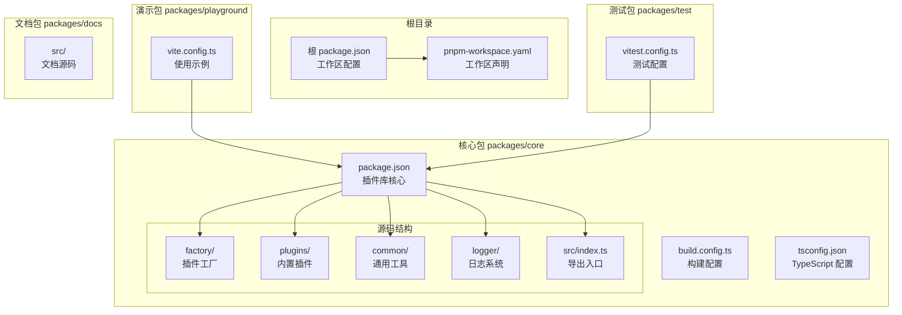
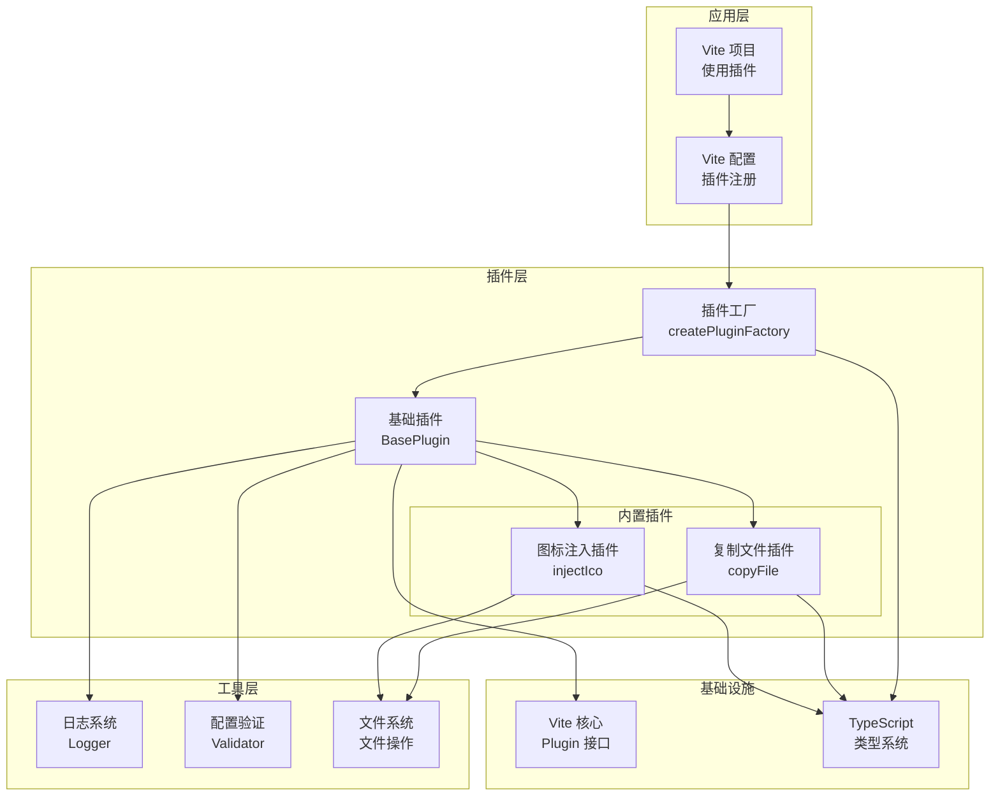
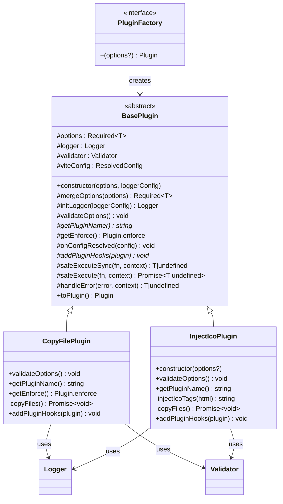
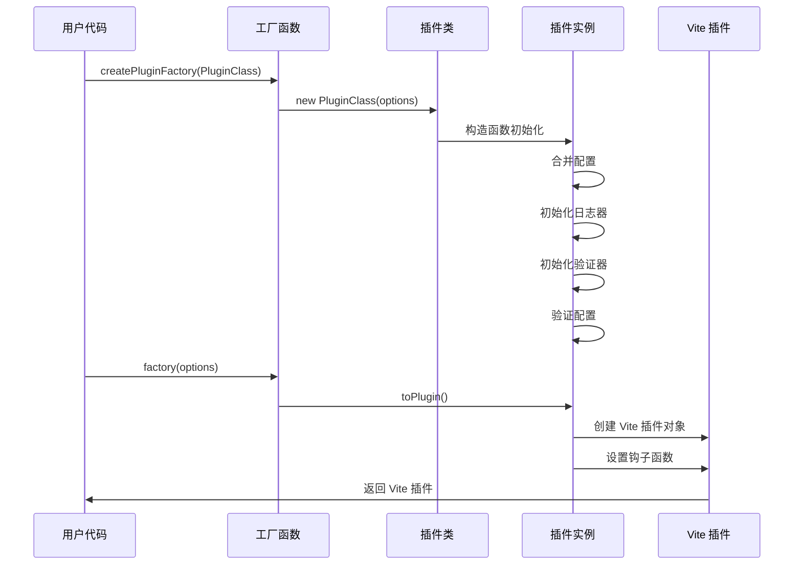
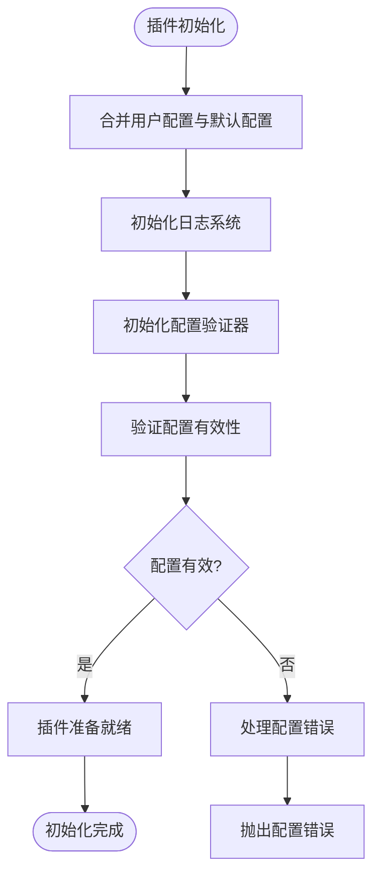
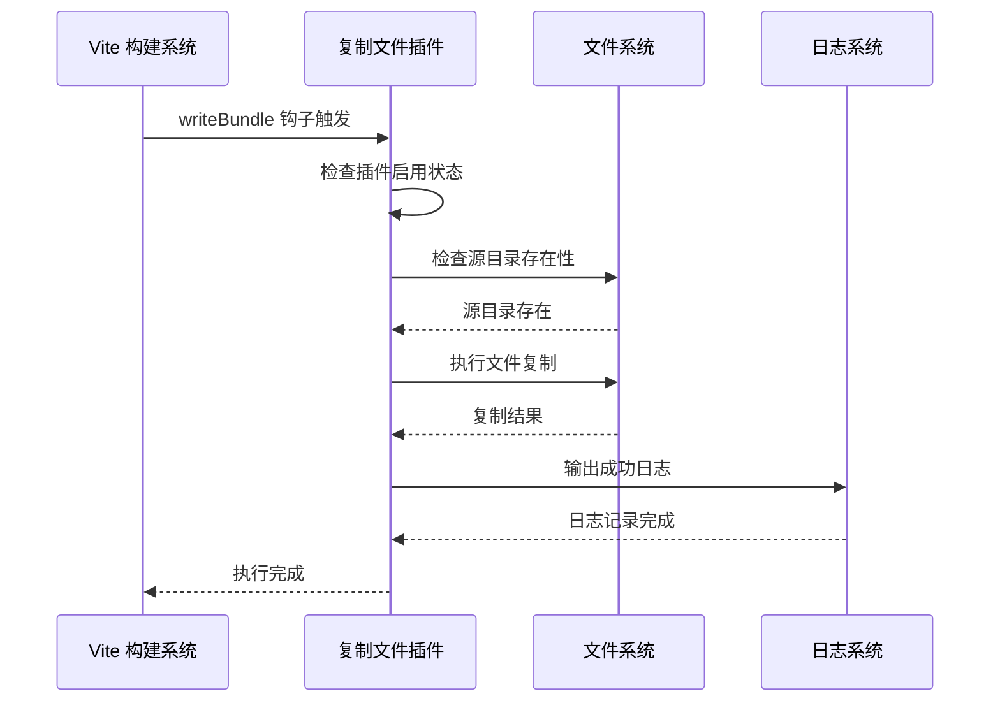
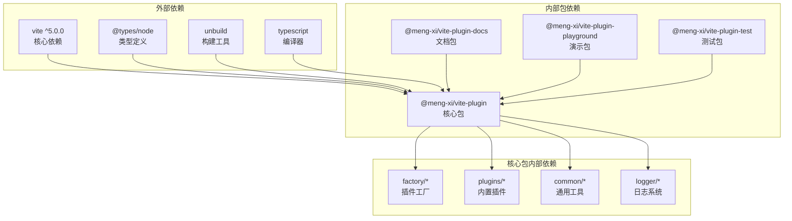

# 项目概述

<cite>
**本文档引用的文件**
- [packages/core/package.json](file://packages/core/package.json)
- [packages/core/src/index.ts](file://packages/core/src/index.ts)
- [packages/core/src/factory/plugin/index.ts](file://packages/core/src/factory/plugin/index.ts)
- [packages/core/src/plugins/index.ts](file://packages/core/src/plugins/index.ts)
- [packages/core/src/plugins/copyFile/index.ts](file://packages/core/src/plugins/copyFile/index.ts)
- [packages/core/src/plugins/injectIco/index.ts](file://packages/core/src/plugins/injectIco/index.ts)
- [packages/core/src/common/index.ts](file://packages/core/src/common/index.ts)
- [packages/core/src/logger/index.ts](file://packages/core/src/logger/index.ts)
- [packages/core/src/factory/plugin/types.ts](file://packages/core/src/factory/plugin/types.ts)
- [packages/core/src/plugins/copyFile/types.ts](file://packages/core/src/plugins/copyFile/types.ts)
- [packages/core/src/plugins/injectIco/types.ts](file://packages/core/src/plugins/injectIco/types.ts)
- [packages/core/build.config.ts](file://packages/core/build.config.ts)
- [packages/core/tsconfig.json](file://packages/core/tsconfig.json)
- [packages/playground/vite.config.ts](file://packages/playground/vite.config.ts)
- [packages/test/vitest.config.ts](file://packages/test/vitest.config.ts)
- [package.json](file://package.json)
- [pnpm-workspace.yaml](file://pnpm-workspace.yaml)
- [README.md](file://README.md)
</cite>

## 目录
1. [简介](#简介)
2. [项目结构](#项目结构)
3. [核心组件](#核心组件)
4. [架构总览](#架构总览)
5. [详细组件分析](#详细组件分析)
6. [依赖分析](#依赖分析)
7. [性能考虑](#性能考虑)
8. [故障排除指南](#故障排除指南)
9. [结论](#结论)
10. [附录](#附录)

## 简介
本项目是一个为 Vite 提供实用插件的工具包，旨在简化构建流程、提升开发效率。项目采用 monorepo 结构组织，通过统一的插件工厂系统提供模块化、可配置且类型安全的插件扩展能力。核心价值体现在：

- **增强 Vite 构建流程**：提供实用插件集合，扩展 Vite 功能，简化构建过程中的常见任务
- **模块化插件架构**：插件可独立使用或组合使用，灵活适配不同项目需求
- **高度可配置性**：所有功能支持详细配置选项，可根据项目需求自定义行为
- **类型安全保障**：完全使用 TypeScript 开发，提供完整类型定义
- **无缝生态集成**：与 Vite 构建流程无缝集成，无需复杂配置即可快速启用

## 项目结构
项目采用 pnpm workspaces 的 monorepo 结构，主要包含以下核心包：



**图表来源**
- [package.json](file://package.json#L7-L9)
- [pnpm-workspace.yaml](file://pnpm-workspace.yaml#L1-L2)
- [packages/core/package.json](file://packages/core/package.json#L1-L55)

**章节来源**
- [package.json](file://package.json#L1-L47)
- [pnpm-workspace.yaml](file://pnpm-workspace.yaml#L1-L2)

## 核心组件
项目的核心由四个关键组件构成，它们协同工作提供完整的插件生态系统：

### 插件工厂系统
插件工厂系统是整个项目的设计核心，它提供了统一的插件创建和管理机制。通过工厂模式，项目实现了插件的标准化创建、配置管理和生命周期控制。

### 基础插件抽象类
BasePlugin 抽象类为所有具体插件提供了统一的基类实现，包含了配置管理、日志记录、错误处理和生命周期管理等核心功能。

### 内置插件集合
项目提供了两个经过精心设计的内置插件：文件复制插件和图标注入插件，它们展示了工厂系统的强大功能和实际应用场景。

### 通用工具库
包括文件系统操作、对象处理和配置验证等通用工具，为插件开发提供了坚实的基础。

**章节来源**
- [packages/core/src/factory/plugin/index.ts](file://packages/core/src/factory/plugin/index.ts#L27-L337)
- [packages/core/src/plugins/index.ts](file://packages/core/src/plugins/index.ts#L1-L3)

## 架构总览
项目采用分层架构设计，通过清晰的职责分离和依赖管理实现了高度模块化的插件系统：



**图表来源**
- [packages/core/src/factory/plugin/index.ts](file://packages/core/src/factory/plugin/index.ts#L371-L383)
- [packages/core/src/plugins/copyFile/index.ts](file://packages/core/src/plugins/copyFile/index.ts#L13-L115)
- [packages/core/src/plugins/injectIco/index.ts](file://packages/core/src/plugins/injectIco/index.ts#L14-L177)

### 设计理念
项目遵循以下核心设计理念：

1. **开闭原则**：对扩展开放，对修改封闭。通过工厂模式和抽象基类，允许新增插件而无需修改现有代码。

2. **单一职责**：每个组件都有明确的职责分工，插件工厂负责创建，基础类负责管理，工具类负责功能实现。

3. **依赖倒置**：高层模块不依赖低层模块的具体实现，而是依赖抽象接口。

4. **接口隔离**：通过清晰的接口定义，确保组件间的松耦合。

**章节来源**
- [packages/core/src/factory/plugin/index.ts](file://packages/core/src/factory/plugin/index.ts#L7-L337)

## 详细组件分析

### 插件工厂系统
插件工厂系统是项目的核心创新点，它提供了一套完整的插件创建和管理机制。



**图表来源**
- [packages/core/src/factory/plugin/index.ts](file://packages/core/src/factory/plugin/index.ts#L27-L337)
- [packages/core/src/plugins/copyFile/index.ts](file://packages/core/src/plugins/copyFile/index.ts#L13-L82)
- [packages/core/src/plugins/injectIco/index.ts](file://packages/core/src/plugins/injectIco/index.ts#L14-L139)

#### 工厂函数实现
插件工厂函数 `createPluginFactory` 提供了类型安全的插件创建机制：



**图表来源**
- [packages/core/src/factory/plugin/index.ts](file://packages/core/src/factory/plugin/index.ts#L371-L383)
- [packages/core/src/factory/plugin/index.ts](file://packages/core/src/factory/plugin/index.ts#L320-L336)

**章节来源**
- [packages/core/src/factory/plugin/index.ts](file://packages/core/src/factory/plugin/index.ts#L371-L383)
- [packages/core/src/factory/plugin/types.ts](file://packages/core/src/factory/plugin/types.ts#L31-L37)

### 基础插件抽象类
BasePlugin 抽象类为所有插件提供了统一的基础设施，包括配置管理、日志记录和错误处理。

#### 配置管理系统
配置系统采用深度合并策略，确保插件具有完整的默认配置：



**图表来源**
- [packages/core/src/factory/plugin/index.ts](file://packages/core/src/factory/plugin/index.ts#L69-L81)
- [packages/core/src/factory/plugin/index.ts](file://packages/core/src/factory/plugin/index.ts#L98-L106)

#### 错误处理机制
项目提供了三种错误处理策略，支持灵活的错误处理模式：

| 策略 | 行为描述 | 适用场景 |
|------|----------|----------|
| throw | 记录错误并抛出异常，中断执行 | 生产环境，需要严格错误控制 |
| log | 记录错误但继续执行 | 开发环境，需要完整日志 |
| ignore | 记录错误并继续执行 | 非关键功能，不影响主流程 |

**章节来源**
- [packages/core/src/factory/plugin/index.ts](file://packages/core/src/factory/plugin/index.ts#L272-L300)

### 复制文件插件
复制文件插件展示了插件工厂系统的强大功能，提供了完整的文件复制解决方案。

#### 插件执行流程
插件在 Vite 构建完成后执行，确保静态资源在最终打包阶段被正确处理：



**图表来源**
- [packages/core/src/plugins/copyFile/index.ts](file://packages/core/src/plugins/copyFile/index.ts#L77-L81)
- [packages/core/src/plugins/copyFile/index.ts](file://packages/core/src/plugins/copyFile/index.ts#L53-L75)

#### 配置选项详解
复制文件插件支持丰富的配置选项，满足不同场景的需求：

| 配置项 | 类型 | 默认值 | 描述 |
|--------|------|--------|------|
| sourceDir | string | 必填 | 源文件目录路径 |
| targetDir | string | 必填 | 目标文件目录路径 |
| overwrite | boolean | true | 是否覆盖同名文件 |
| recursive | boolean | true | 是否递归复制 |
| incremental | boolean | true | 是否启用增量复制 |
| enabled | boolean | true | 是否启用插件 |
| verbose | boolean | true | 是否输出详细日志 |
| errorStrategy | enum | 'throw' | 错误处理策略 |

**章节来源**
- [packages/core/src/plugins/copyFile/types.ts](file://packages/core/src/plugins/copyFile/types.ts#L8-L43)

### 图标注入插件
图标注入插件结合了 HTML 处理和文件复制功能，提供了完整的网站图标解决方案。

#### 多阶段执行模型
插件采用双阶段执行模型，既能在构建时注入图标链接，又能在打包后复制图标文件：


**图表来源**
- [packages/core/src/plugins/injectIco/index.ts](file://packages/core/src/plugins/injectIco/index.ts#L130-L138)
- [packages/core/src/plugins/injectIco/index.ts](file://packages/core/src/plugins/injectIco/index.ts#L55-L89)

#### 图标配置灵活性
插件支持多种图标配置方式，适应不同的使用场景：

1. **字符串配置**：直接传入基础路径，系统自动生成默认 favicon.ico 链接
2. **基本配置**：提供 base 参数，使用默认 favicon.ico
3. **完整 URL**：直接指定完整的图标 URL
4. **自定义图标数组**：支持多种格式和尺寸的图标
5. **带文件复制**：同时配置图标文件复制功能

**章节来源**
- [packages/core/src/plugins/injectIco/types.ts](file://packages/core/src/plugins/injectIco/types.ts#L70-L112)

### 日志系统
项目内置了功能完整的日志系统，支持多种日志级别和格式化输出。

#### 日志类型与样式
系统为不同类型的日志提供了相应的视觉标识和颜色编码：

| 日志类型 | 图标 | 颜色 | 用途 |
|----------|------|------|------|
| info | - | 默认 | 一般信息输出 |
| success | ✅ | 绿色 | 成功操作提示 |
| warn | ⚠️ | 黄色 | 警告信息 |
| error | ❌ | 红色 | 错误信息 |

#### 日志输出格式
日志采用统一的格式化输出，包含时间戳、插件名称和详细的消息内容：

```
==================================
[时间戳] [@meng-xi/vite-plugin:插件名称] 日志消息
==================================
```

**章节来源**
- [packages/core/src/logger/index.ts](file://packages/core/src/logger/index.ts#L23-L48)
- [packages/core/src/logger/index.ts](file://packages/core/src/logger/index.ts#L78-L93)

## 依赖分析
项目采用清晰的依赖管理策略，确保模块间的松耦合和高内聚。



**图表来源**
- [packages/core/package.json](file://packages/core/package.json#L32-L42)
- [package.json](file://package.json#L7-L9)

### 版本兼容性
项目严格遵循语义化版本控制，确保向后兼容性和稳定的升级路径：

- **Vite 兼容性**：支持 Vite 5.x 版本系列
- **Node.js 兼容性**：支持现代 Node.js LTS 版本
- **TypeScript 兼容性**：支持 TypeScript 5.x 版本
- **包管理器**：推荐使用 pnpm，兼容 npm 和 yarn

**章节来源**
- [packages/core/package.json](file://packages/core/package.json#L32-L37)
- [packages/core/tsconfig.json](file://packages/core/tsconfig.json#L1-L31)

## 性能考虑
项目在设计时充分考虑了性能优化，通过多种策略确保高效的插件执行：

### 增量复制机制
复制文件插件支持增量复制功能，只处理发生变化的文件，显著减少不必要的 I/O 操作。

### 异步执行优化
插件系统采用异步执行模型，避免阻塞 Vite 的构建流程，确保构建性能不受影响。

### 缓存策略
日志系统和配置验证器都采用了适当的缓存策略，减少重复计算和内存占用。

### 并发处理
对于独立的插件操作，系统支持并发执行，充分利用多核处理器的性能优势。

## 故障排除指南
项目提供了完善的错误处理和诊断机制，帮助开发者快速定位和解决问题。

### 常见问题诊断
1. **插件未生效**：检查插件配置中的 `enabled` 选项和 Vite 配置中的插件注册
2. **文件复制失败**：验证源目录路径存在性和文件权限
3. **HTML 注入失败**：确认目标 HTML 文件包含 `</head>` 标签
4. **类型错误**：检查 TypeScript 配置和导入路径

### 调试技巧
- 启用详细日志模式 (`verbose: true`) 获取完整的执行信息
- 使用 `errorStrategy: 'log'` 在出现错误时继续执行以收集更多信息
- 检查插件实例的 `pluginInstance` 属性获取底层实现细节

**章节来源**
- [packages/core/src/factory/plugin/index.ts](file://packages/core/src/factory/plugin/index.ts#L272-L300)

## 结论
本项目通过精心设计的插件工厂系统和模块化架构，为 Vite 生态系统提供了一个功能强大、易于扩展的插件工具包。其核心优势包括：

1. **统一的开发体验**：通过工厂模式和抽象基类，开发者可以快速创建符合标准的插件
2. **强大的扩展能力**：模块化设计允许轻松添加新插件，同时保持系统的稳定性
3. **完善的工具链**：从类型安全到日志系统，提供了完整的开发和维护工具
4. **优秀的性能表现**：通过增量处理和异步执行，确保构建效率不受影响

项目为初学者提供了清晰的学习路径，为有经验的开发者提供了灵活的扩展机制，是 Vite 生态系统中值得信赖的插件解决方案。

## 附录

### 快速开始示例
```typescript
import { defineConfig } from 'vite'
import vue from '@vitejs/plugin-vue'
import * as vitePlugin from '@meng-xi/vite-plugin'

export default defineConfig({
  plugins: [
    vue(),
    vitePlugin.injectIco({
      base: '/assets',
      copyOptions: {
        sourceDir: 'src/assets',
        targetDir: 'dist/assets'
      }
    }),
    vitePlugin.copyFile({
      sourceDir: 'src/static',
      targetDir: 'dist/static'
    })
  ]
})
```

### 发展路线图
- **短期目标**：完善现有插件功能，增加更多内置插件选项
- **中期规划**：引入插件热重载机制，提升开发体验
- **长期愿景**：建立插件市场，支持社区贡献的第三方插件

**章节来源**
- [packages/playground/vite.config.ts](file://packages/playground/vite.config.ts#L1-L69)